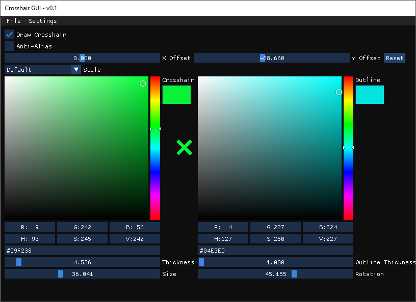
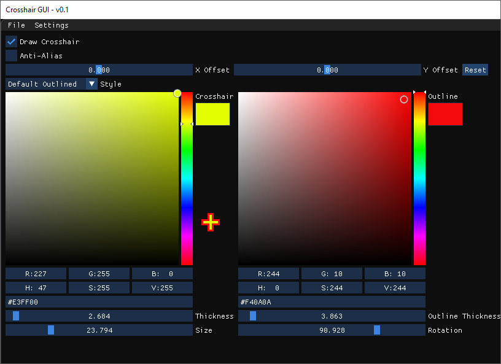
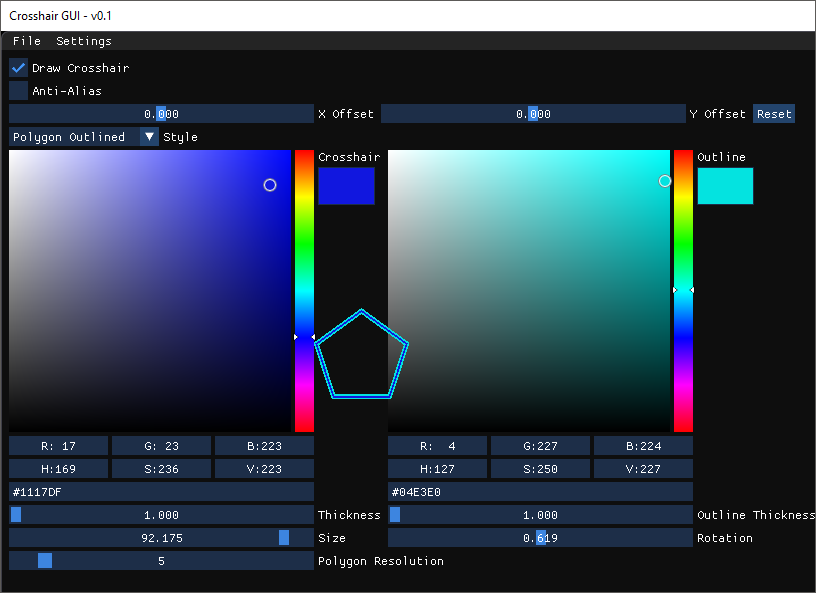
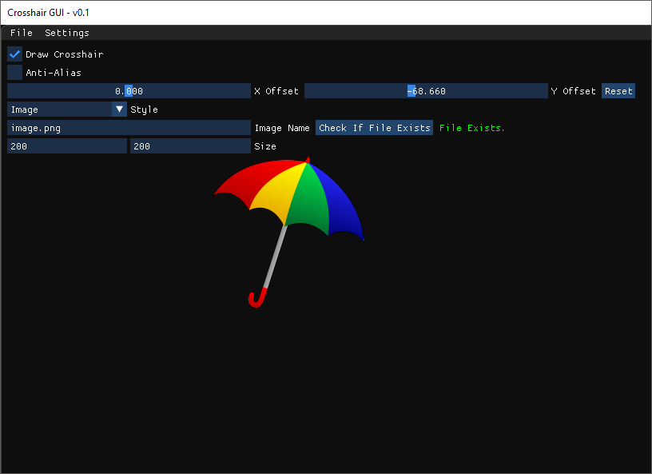

# Crosshair-Overlay
Simplistic, versatile tool to visualize the center of your screen.
Drawing is done on a window which is overlayed above all others. No interaction with any other processes is done.

## Screenshots

### Default Style

### Default Outlined Style

### Polygon Style

### Polygon Outlined Style

### Image Style

## Features
* Loading / saving configuration
* Logging system
* Drawing shapes / images to screen

## Customizability

### Global
* X / Y offset from screen center
* Anti-aliasing

### Default Style
* Thickness
* Size
* Color
* Outline
* Outline thickness
* Outline color
* Rotation

### Polygon Style
* Thickness
* Size
* Color
* Resolution
* Outline
* Outline thickness
* Outline color
* Rotation

### Image Style
* Customizable image (from file relative to executable directory)
